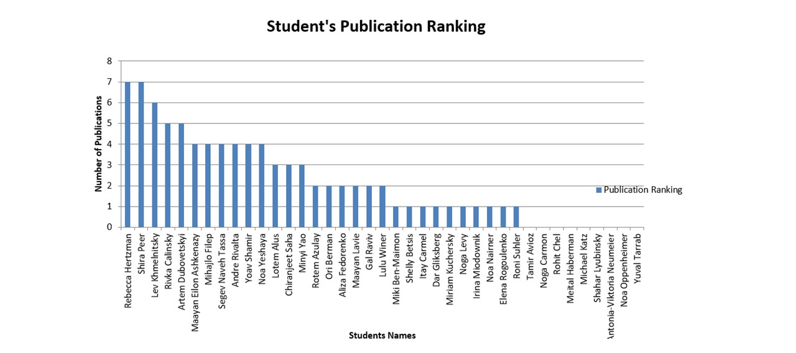
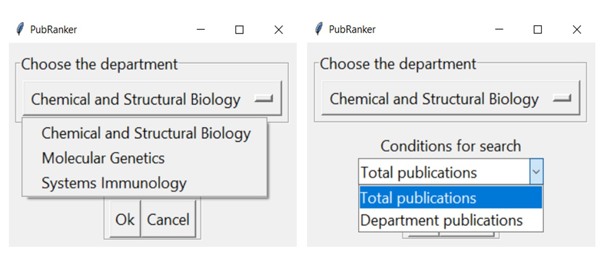

# PubRanker
## Introduction
The committee’s decision on whether a PhD student will receive a scholarship is often influenced by the number of publications the student has. Applying for a scholarship can be a time-consuming process, involving obtaining a recommendation from the principal investigator (PI), writing a letter of motivation, and preparing a resume. This competition for scholarships often occurs within the departments of the Weizmann Institute of Science. **PubRanker** is designed to help students estimate their chances of winning the fellowship relative to other PhD students in their department.

## How does it work?
**PubRanker** collects data from the website of the selected Weizmann department, retrieving the names of the PhD students and their corresponding PIs. Using this data, the app can perform two checks:

1. **Total publications**: The app checks PubMed for publications associated with each student's name to determine the student's total number of publications, regardless of the Weizmann Institute of Science. To reduce the chances of including publications from individuals with similar names, the data is limited to 20 publications per PhD student.
2. **Department-specific publications**: The app queries the PubMed database to find publications coauthored by each student and their PI, estimating how many publications each student has within their Weizmann Institute department.


Depending on the option chosen, **PubRanker** can generate two different plots in an Excel file:
- The one plot shows the total number of publications for each student, with the x-axis representing the students' names and the y-axis showing their total publications.
- The second plot shows the number of department-specific publications for each student, with the x-axis representing the students' names and the y-axis showing the number of publications within the department.
<p align="center">
  
</p>

## Conclusion
With the generated data and plots, PhD students using **PubRanker** will be able to estimate their standing in the publication ranking within their department as well as in total. This will help them determine whether they have a competitive chance of winning the scholarship and whether applying for it is worthwhile.

## Software Dependencies

- Python 3.13

### Packages and libraries:
- tkinter
- bs4
- requests
- pymed
- xlswriter
- time

## Installation

Clone this GitHub repository:
```bash
git clone https://github.com/artemD7/PubRanker
```

## Starting the application
The folder containing the project must be opened in the terminal. The application should then be invoked in the terminal using the following command:
```bash
python PubRanker.py
```
## Usage
In the opened GUI window, select the department of Weizmann Institute of Science for PhD students publication check.
The user is then required to specify whether they wish to check "Total publications" for each student or their publications that have been conducted in collaboration with their respective Principal Investigators (PIs) - "Department publications".
<p align="center">
  
</p>
 <strong>Note:</strong> this project was conducted by Artem Dubovetskyi as part of the [WIS 2024.11 Python course](https://github.com/szabgab/wis-python-course-2024-11) at the Weizmann Institute of Science.
